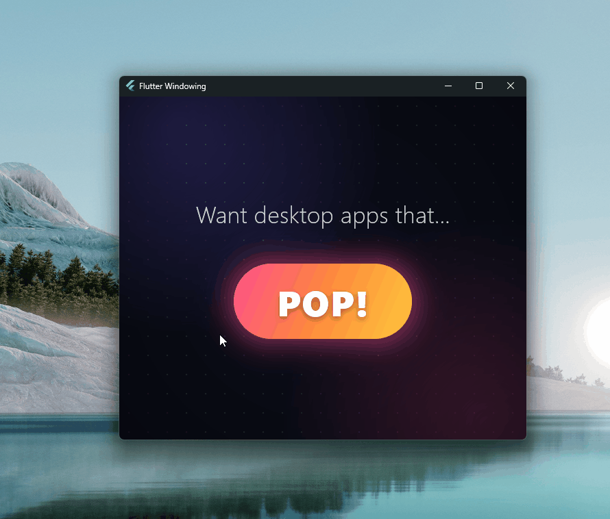
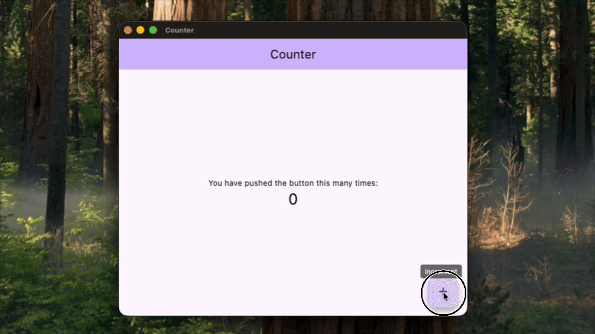
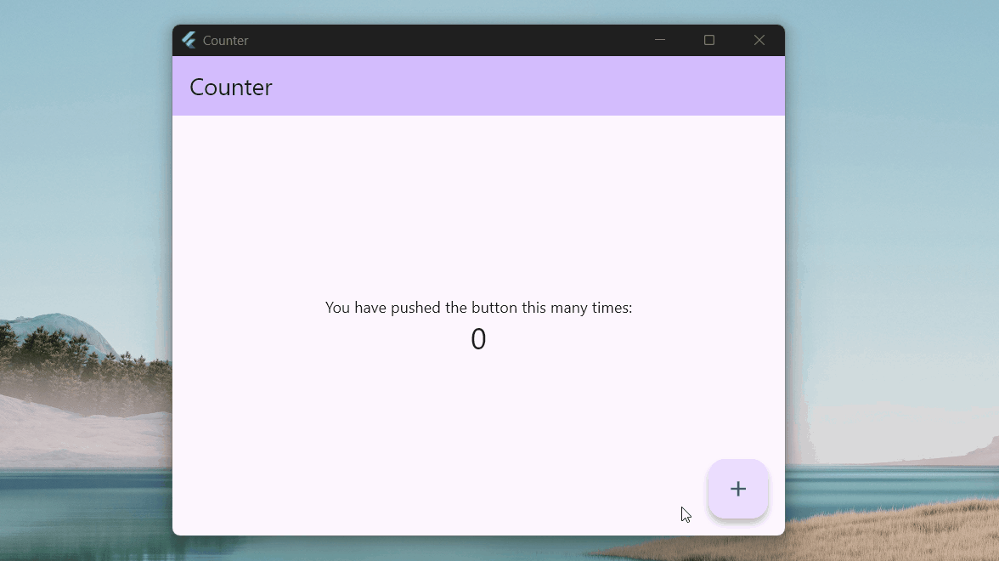
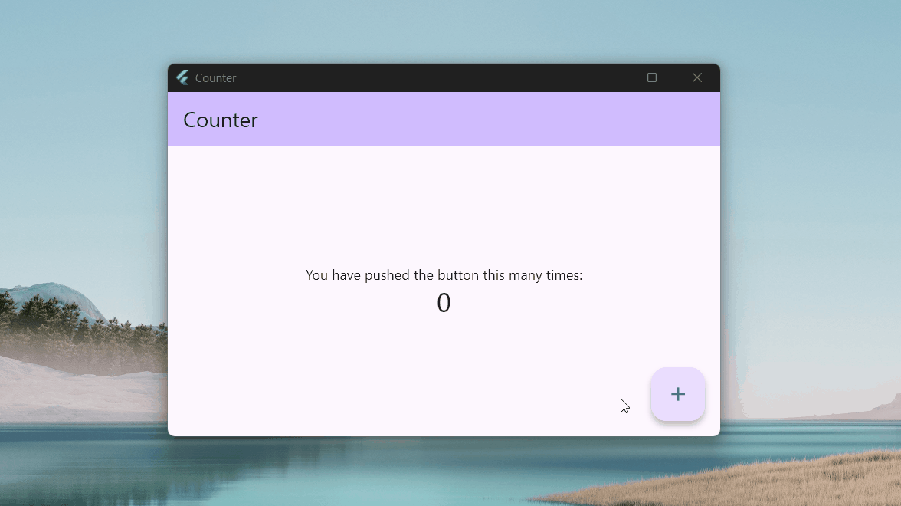
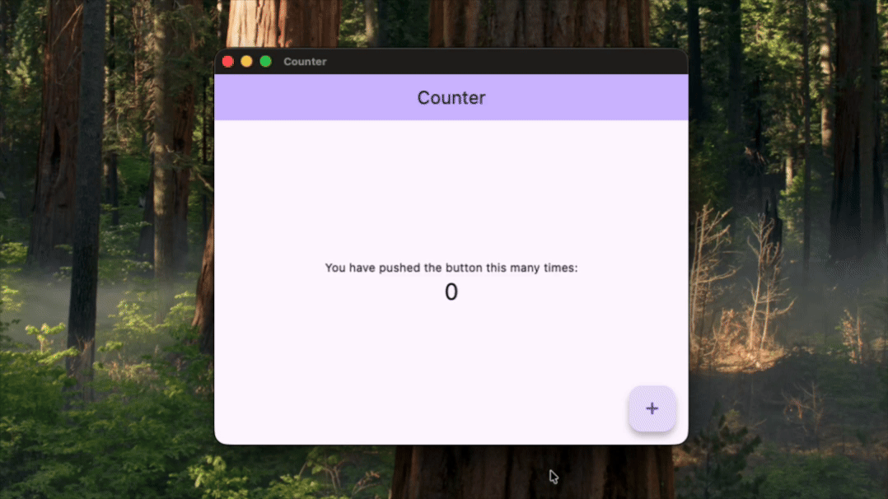
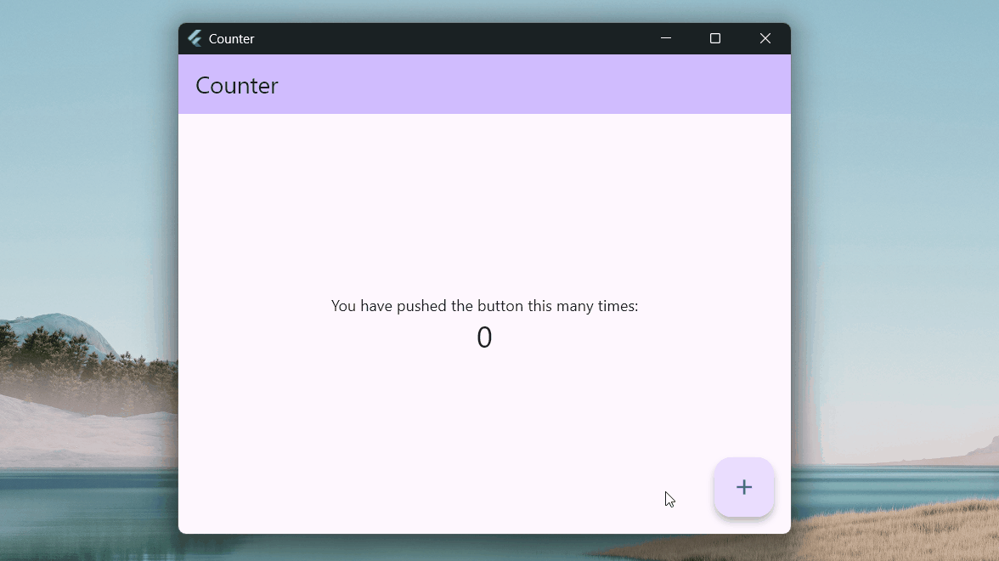
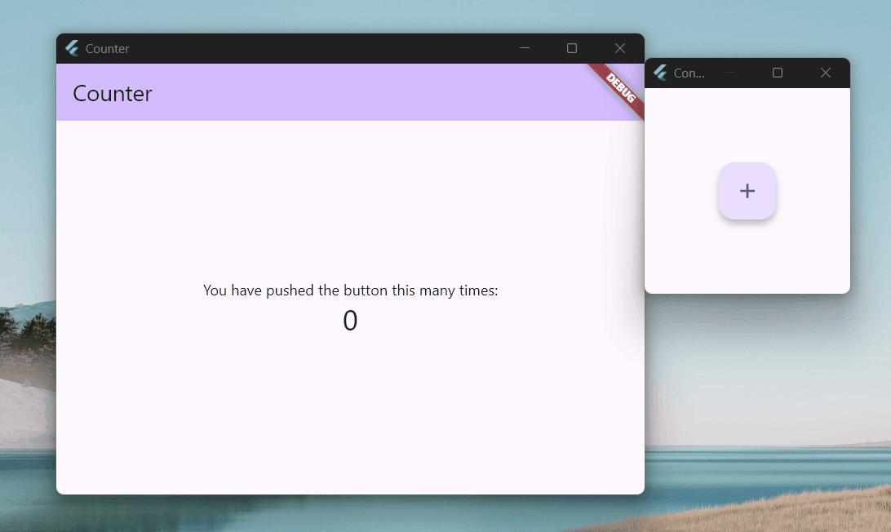

# Windowing API demos

### Window that POPS

<table>
  <tr>
    <th>macOS</th>
    <th>Windows</th>
  </tr>
  <tr>
    <td></td>
    <td></td>
  </tr>
</table>

### Dialog window

<table>
  <tr>
    <th>macOS</th>
    <th>Windows</th>
  </tr>
  <tr>
    <td></td>
    <td></td>
  </tr>
</table>

### Popup window

<table>
  <tr>
    <th>macOS</th>
    <th>Windows</th>
  </tr>
  <tr>
    <td></td>
    <td></td>
  </tr>
</table>

### Tooltip window

<table>
  <tr>
    <th>macOS</th>
    <th>Windows</th>
  </tr>
  <tr>
    <td></td>
    <td></td>
  </tr>
</table>

### Satellite window

<table>
  <tr>
    <th>macOS</th>
    <th>Windows</th>
  </tr>
  <tr>
    <td>N/A</td>
    <td></td>
  </tr>
</table>